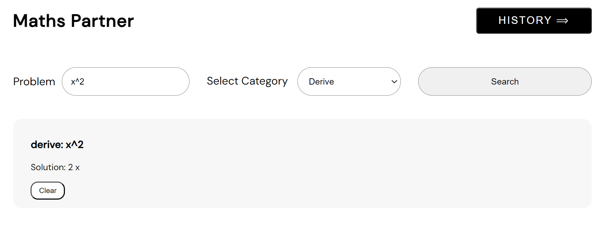

# Maths Partner
Maths Partner is a frontend application designed to help solve complex mathematical problems, with a focus on calculus.

## Features
- <strong>Solve Complex Math Problems:</strong> Search for solutions to intricate mathematical equations and expressions.
- <strong>Supported operations</strong>: Maths Partner offers a range of mathematical operations, including:
    - Simplification of mathematical expressions
    - Factorization
    - Derivation
    - Integration
    - Tangent
    - Area under curve
    - Solving equation for zeroes
    - Trignometry
    - Absolute values
    - Logarithm

  

## Functionality used
- <strong>Problem Input Field</strong>: Users can input their mathematical problems in a dedicated field
- <strong>Problem Category Selection</strong>: Users can choose the category of the mathematical problem they want to solve.
- <strong>Search Button</strong>: Clicking this button submits the problem and problem category for processing.
- <strong>History Button</strong>: Users can access their query history to review past mathematical problems and solutions.
- <strong>Delete Button</strong>: Delete specific entries from the history record.
- <strong>Integration with Newton API</strong>: Maths Partner is integrated with Newton API, which allow users to get instant solutions.
- <strong>ASCII conversion</strong>: Mathematical inputs are converted into a URL-friendly format using encodeURIComponent before sending API requests.

  

## Tech stack used
- HTML
- CSS
- JavaScript

  

### Thanks for visiting Maths Partner